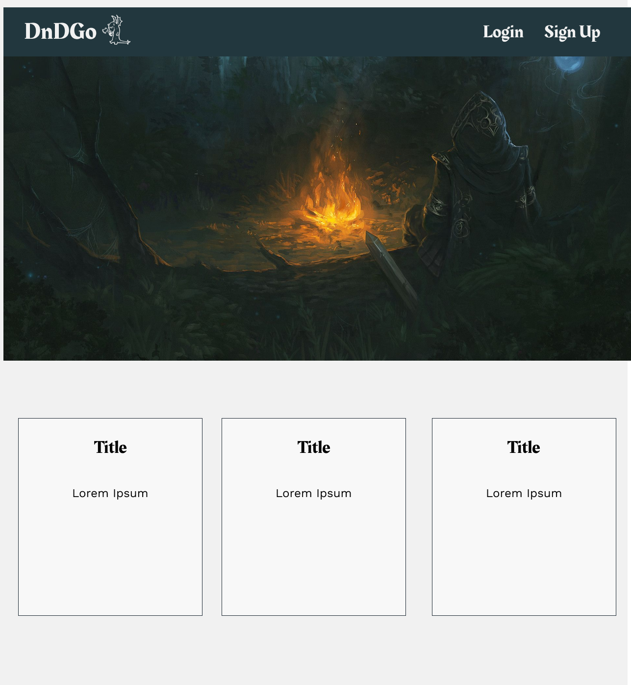
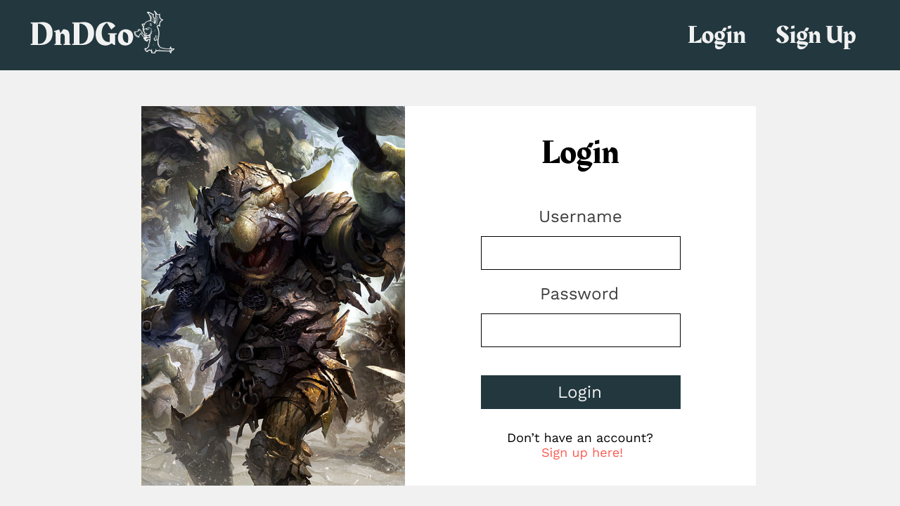
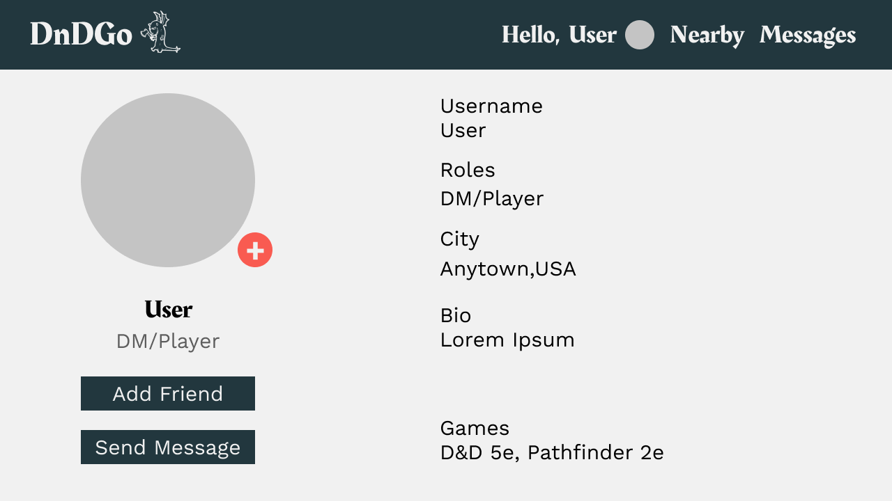
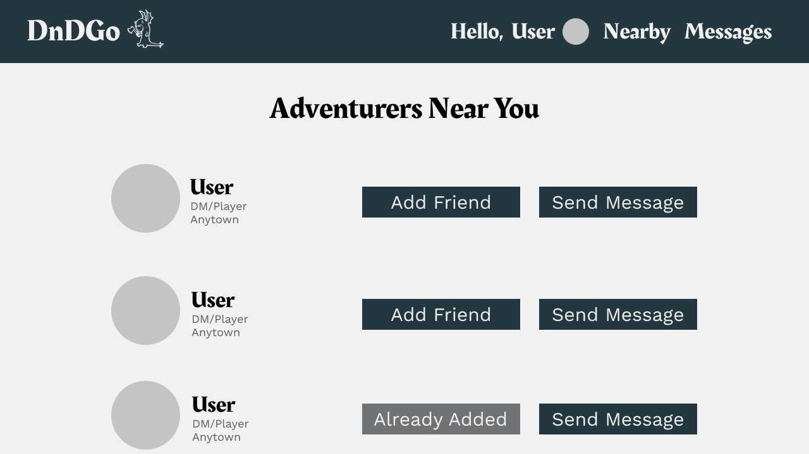

# DNDGO

Link: [DND](http://dndgo.timotheusdesigns.com/)
Backend Code: [Backend](https://github.com/TimothyAllgood/dnd-backend)

## About the Project

DNDGO is a full stack web app, that aims to connect people interested in tabletop role playing games, such as Dungeons and Dragons. In this hobby it is sometimes difficult for players to meet new people that also enjoy the hobby in your area. This application aims to solve this problem by utilizing user locations to connect people in a geographic range. By doing this the app will negate some of the anxiety and stress of finding people that enjoy this hobby as well.

## Wireframes

## User Stories

    - A user is able to visit the site and create an account.
    - If they have an account they are able to login and view their profile
    - Upon creating an account a user is able to edit their profile with additional info
    - A logged-in user will be able to add other registered users as friends
    - A logged-in user will be able to message other registered users
    - A logged-in user will be able to view other registered users that are near them geographically

- Stretch Goals
  - Added RTC feature, utilizing Socket.io
  - A user can send messages to other users
  - The message will be displayed in real time, meaning the user will not have to refresh the page to view the new message

## Planned Features

    - Add the ability for users to create games
    - Games will act as a lobby for a group of users
    - In this lobby, users will be able to communicate about their specific meetup, whether it be online or in person

## Technologies Used

This project was built using the MERN stack

- MongoDB
- React
- Node.js
- Express
- CSS
- Socket.io
